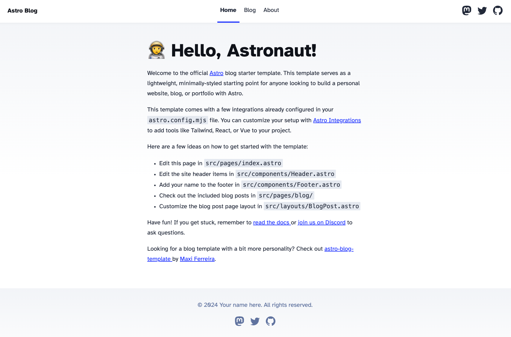

I had an existing "portfolio site" (if you can even call it that) that I wasn't super happy with. Not minimal enough, and in my opinion not a great showcase of my work. I wanted to start from scratch and have a more "structured" way to talk about the work that I've done. That brings us to today.

What better way to kick off blogging about how I build things than with the building of this blog? Thankfully, the tooling out there for doing things like this is borderline overpowered, especially when you reach for something like [Astro](https://astro.build/).

# What is Astro?

According to their [docs](https://docs.astro.build/en/concepts/why-astro/):

> **Astro** is the web framework for building **content-driven websites** like blogs, marketing, and e-commerce

Makes sense to me! There's a bunch more in there about some of the benefits and features, but what I like about it ultimately boils down to the following:

- It's fast and has great SEO (without me having to actually learn how to achieve great SEO)
- It's accessible
- It's easy to build and deploy

Coming from React-land, there's a few nuances to get used to, especially if you're building in any reactivity, but at the end of the day it just feels like writing tried and true HTML+CSS with nice built-in support for the things I always want a framework to do for me (out of the box routing, a dev server with hot reloading, re-usable components, etc.).

Overall, I'm super happy with this choice. I am _definitely_ one of those people that would build their tech blog using some unnecessarily complex architecture just for the fun of it, but I resisted the urge in the name of simplicity!

# Initial Setup with Astro

Naturally, I had to start with the dopamine hit of setting up a brand new repository. There's something oh so satisfying about a clean slate and a blank canvas. Astro's CLI makes it super easy to initialize a new project:

```sh
pnpm create astro@latest
```

(As an aside, I pretty much reach for [pnpm](https://pnpm.io/) whenever I start a new project now. I'll spare you the details, but read more [here](https://pnpm.io/pnpm-vs-npm) if you're curious)

The Astro CLI will ask you some setup questions, the ones that really matter being:

1. How would you like to start your new project (I picked the blog template to avoid some of the up front boilerplate configuration)
2. Do you plan to write TypeScript (yes, I'm not a monster)

This creates a whole bunch of stuff, here's the TL;DR:

```
.
├── ...
├── src
│   ├── components              --> any shared components, like navbars or other utilities
│   │   └── ...
│   ├── content
│   │   ├── blog                --> markdown files of blog posts
│   │   │   └── ...
│   │   └── config.ts           --> type-safety for blog post content (yay)
│   ├── layouts                 --> any shared layouts to use for pages throughout the site
│   │   └── ...
│   ├── pages
│   │   ├── blog
│   │   │   ├── [...slug].astro --> the route for an individual blog post
│   │   │   └── index.astro     --> the route for the "homepage" of the blog
│   │   ├── index.astro         --> the route for the homepage of the whole site
│   │   └── rss.xml.js          --> do people still subscribe to blogs with RSS nowadays?
│   └── styles
│       └── global.css          --> stuff we're going to inevitably delete in favor of using tailwind
├── ...
```

Now we can run the dev server just to see the results:

```sh
pnpm dev
```



# Removing Some Boilerplate and Adding Tailwind

The blog that you get out of the box with this setup is pretty nice! Going into this though, it's important to me to have more control over the layout and design of it all. Going with this template was a nice way for me to get some of the initial setup/configuration out of the way so I can focus on the content and styling.

When it comes to styling, I almost always reach for [Tailwind](https://tailwindcss.com/). Never in my life have I been able to both design and implement said design as quickly as I can with Tailwind. There's an initial learning curve for sure, but once you get going, the name Tailwind is _very_ appropriate.

Thankfully, Astro does most of the setup work for me with their [Tailwind integration](https://docs.astro.build/en/guides/integrations-guide/tailwind/):

```sh
pnpm astro add tailwind
```

While I love the power and control that Tailwind gives me, I am going to take advantage of their [typography plugin](https://github.com/tailwindlabs/tailwindcss-typography) to handle the styling of markdown elements for me. This gives each blog post some sensible defaults that are entirely customizable.

All I had to do was follow [Astro's guide](https://docs.astro.build/en/recipes/tailwind-rendered-markdown/#setting-up-tailwindcsstypography) for styling markdown with this plugin, add `class="prose"` to the root element of what is rendering each blog post markdown, and boom! Markdown content looks a lot nicer now.

```astro
---
// src/layouts/BlogPost.astro
// ...
---

<html lang="en">
  <!-- ... -->
  <div class="prose">
    <div>
      <div>
        <FormattedDate date={pubDate} />
        {
          updatedDate && (
            <div>
              Last updated on <FormattedDate date={updatedDate} />
            </div>
          )
        }
      </div>
      <h1>{title}</h1>
      <hr />
    </div>
    <slot />
  </div>
  <!-- ... -->
</html>
```

So to recap,

- I now have a basic skeleton of a website, where I can add whatever contents and routes I want, styled with TailwindCSS
- I can place and new blog posts as markdown files in `src/content/blog/*.md`, and it will automagically show up in the post list, styled by Tailwind's typography plugin

# What's Next?

Well, I'm not sure! So far, I've added a very minimal homepage, and written this post as my first. I'll probably work more on customizing the look and feel of the site, and giving it more personality.

I also plan on writing more posts chronicling all the side projects I've worked on in the past year or two, as I've got so many thoughts and opinions kicking around my head about them. Might as well put them here!

The code for this website is open source, and can be found [here on my GitHub](https://github.com/mgramigna/gramigna.dev). Follow along for the journey!
