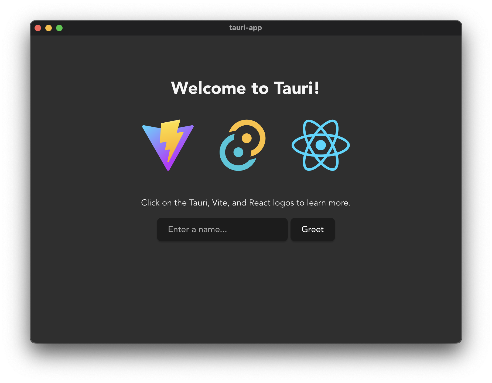

I've recently been playing around with [Tauri](https://tauri.app/), a Rust-based framework for building performant desktop applications. So far, I'm pretty impressed, and I like it waaaaay better than Electron (not to mention the exponentially smaller footprint)!

Similar to Electron, Tauri uses the concept of [commands](https://tauri.app/v1/references/architecture/inter-process-communication/#commands) to communicate with the frontend via [Inter-process communication](https://en.wikipedia.org/wiki/Inter-process_communication) (IPC). This means that in our TypeScript frontend, we will be calling out to our Rust backend via IPC.

Because I am addicted to type-safety, this immediately made me wonder how I would know what names to use for the commands, what args to pass in, and what the shape of the response was. This post will go through a basic example of setting up a Tauri app with type-safe commands using [zod](https://zod.dev/).

# Tauri Quickstart

To get started, we can use `create-tauri-app`, linked on the [homepage](https://tauri.app/):

```sh
sh <(curl https://create.tauri.app/sh)
```

Fill out the prompts to your liking. I will be using React and [Bun](https://bun.sh/) for simplicity.

```
info: downloading create-tauri-app
✔ Project name · tauri-app
✔ Choose which language to use for your frontend · TypeScript / JavaScript - (pnpm, yarn, npm, bun)
✔ Choose your package manager · bun
✔ Choose your UI template · React - (https://react.dev/)
✔ Choose your UI flavor · TypeScript

Template created! To get started run:
  cd tauri-app
  bun install
  bun run tauri dev
```

After using the above commands, we are greeted with our new Tauri app!



# Relevant Code

Since we'll be focused on commands for the purposes of this post, I'll point out some of the relevant pieces of Rust and TypeScript code that we'll be updating with type-safety.

First, let's look at the `greet` command defined in rust

```rust
// src-tauri/src/main.rs

#[tauri::command]
fn greet(name: &str) -> String {
    format!("Hello, {}! You've been greeted from Rust!", name)
}
```

This tells us that we can invoke a command called `greet`, pass in an argument `name`, and get a string result back from the command.

We can then see how the TypeScript frontend invokes this command using Tauri's `invoke` API:

```typescript
// src/App.tsx
import { invoke } from "@tauri-apps/api/tauri";

function App() {
  // ...
  const [name, setName] = useState("");

  async function greet() {
    setGreetMsg(await invoke("greet", { name }));
  }

  // ...
}
```

A couple key things to point out:

1. The first argument to `invoke` **must** match the name of the function defined in `src-tauri/src/main.rs`
2. The second argument to the `invoke` command can either be omitted entirely, or be an object whose properties match what is defined in `src-tauri/src/main.rs`

A couple key issues to point out with the above facts:

1. TypeScript knows nothing about this string. I could change it to `'say_hello'`, and the TypeScript compiler won't see any issue with this. Tauri will throw a runtime error if it can't understand the command names
2. TypeScript knows nothing about this argument. The keys could be anything, and the values could be anything. Tauri will throw a runtime error if it can't understand the args

The goal here is to make a better developer experience from TypeScript land when invoking these commands. We will focus on addressing the above 2 problems

# Adding Type-Safety to the Greet Command

We will be using [zod](https://zod.dev/) to define 3 key pieces that help us accomplish our goals:

1. A schema for the inputs of the command invocation (name, args)
2. A schema for the ouput of the command invocation (i.e. the return result from Rust land)
3. A utility function that wraps Tauri's `invoke` API and uses the above schemas to add type-safety

## Defining the Schemas

We will stick with the `greet` command from the example, and define some zod schemas for the inputs and outputs:

```typescript
// src/commands/greet.ts

import { z } from "zod";

export const GreetCommandArgsSchema = z.object({
  name: z.string(),
});
export type GreetCommandArgs = z.infer<typeof GreetCommandArgsSchema>;

export const GreetCommandSchema = z.object({
  commandName: z.literal("greet"), // Must match Rust function name
  args: GreetCommandArgsSchema,
});
```

We can then use these `greet` schemas to define an overall `Command` schema. This will be a `discriminatedUnion` of all the commands we might define in our application (read more about discriminated unions [here](https://zod.dev/?id=discriminated-unions)).

```typescript
// src/commands/index.ts
import { z } from "zod";
import { GreetCommandSchema } from "./greet";

export const CommandSchema = z.discriminatedUnion("commandName", [
  GreetCommandSchema,
]);
export type Command = z.infer<typeof CommandSchema>;
//                ^?
//                 type Command = {
//                     commandName: "greet";
//                     args: {
//                         name: string;
//                     };
//                 }
```

We only have the `greet` command for now, but we will extend this in the future!

## Defining the Invoke Wrapper

Lastly, we can add a function that uses these schemas to invoke the commands and parse the results

```typescript
// src/commands/util.ts

import { invoke } from "@tauri-apps/api";
import { ZodType, ZodTypeDef } from "zod";
import { Command } from ".";

export async function invokeCommand<T>({
  command,
  resolver,
}: {
  command: Command;
  resolver: ZodType<T, ZodTypeDef, T>;
}): Promise<T> {
  const result = await invoke(command.commandName, command.args);
  return resolver.parse(result);
}
```

We can use the generic `T` here to infer the return type of the function to whatever the zod schema parses to. This will come in handy when actually invoking the command, as the return result will be type-safe.

## Updating the Invocation

```typescript
// src/App.tsx
import { invoke } from "@tauri-apps/api/tauri";
import { GreetCommandOutputSchema } from "./commands/greet";
import { invokeCommand } from "./commands/util";

function App() {
  // ...
  const [name, setName] = useState("");

  async function greet() {
    const result = invokeCommand({
      //     ^? const result: string
      command: {
        commandName: "greet",
        args,
      },
      resolver: GreetCommandOutputSchema,
    });

    setGreetMsg(result);
  }

  // ...
}
```

TypeScript is now smart enough to know that when we invoke the `greet` command, the result is a string. It also will throw a type error if we pass in a command name other than `'greet'`, or arguments of a different type signature!

# Extending Our Approach

We have accomplished our goals! I feel much better about working with commands now. I'll quickly show how to take this even further when the inputs/outputs of the command are more complex. Let's say that we have a new `gree_person` command which instead returns a serialized struct as JSON back to the frontend.

First, we can define the command in Rust:

```rust
//src-tauri/src/main.rs

// ...

#[derive(Serialize, Deserialize)] // Ensure that serde knows how to serialize and deserialize
struct Person {
    name: String,
    age: u64,
}

#[tauri::command]
fn greet_person(name: String, age: u64) -> Person {
    Person { name, age }
}

fn main() {
    tauri::Builder::default()
        .invoke_handler(tauri::generate_handler![greet, greet_person]) // Must register the new command here
        .run(tauri::generate_context!())
        .expect("error while running tauri application");
}
```

We can then update our schemas to add the new command:

```typescript
// src/commands/greetPerson.ts

import { z } from "zod";

export const GreetPersonCommandArgsSchema = z.object({
  name: z.string(),
  age: z.number(),
});
export type GreetPersonCommandArgs = z.infer<
  typeof GreetPersonCommandArgsSchema
>;

export const GreetPersonCommandSchema = z.object({
  commandName: z.literal("greet_person"), // Matches the name of the Rust function
  args: GreetPersonCommandArgsSchema,
});

// Matches the struct we defined in Rust
export const GreetPersonCommandOutputSchema = z.object({
  name: z.string(),
  age: z.number(),
});
```

We can add the schema to the `discriminatedUnion`, and the `Command` type is automatically updated!

```typescript
// src/commands/index.ts

import { z } from "zod";
import { GreetCommandSchema } from "./greet";
import { GreetPersonCommandSchema } from "./greetPerson";

export const CommandSchema = z.discriminatedUnion("commandName", [
  GreetCommandSchema,
  GreetPersonCommandSchema, // Added our new schema here
]);
export type Command = z.infer<typeof CommandSchema>;
//                ^?
//                type Command = {
//                    commandName: "greet";
//                    args: {
//                        name: string;
//                    };
//                } | {
//                    commandName: "greet_person";
//                    args: {
//                        name: string;
//                        age: number;
//                    };
//                }
```

Lastly, the `invokeCommand` wrapper that we made is still smart enough to give us back the right return result when the new schema is passed in as the resolver:

```typescript
// src/App.tsx

import { invoke } from "@tauri-apps/api/tauri";
import {
  GreetPersonCommandOutputSchema,
  invokeGreetPerson,
} from "./commands/greetPerson";
import { invokeCommand } from "./commands/util";

function App() {
  // ...
  const [name, setName] = useState("");

  async function greet() {
    const result = await invokeCommand({
      //       ^?
      //       const result: {
      //         name: string;
      //         age: number;
      //       }
      command: {
        commandName: "greet_person",
        args: {
          age: 100,
          name,
        },
      },
      resolver: GreetPersonCommandOutputSchema,
    });
  }

  // ...
}
```

# Conclusion

I'm having a really good time with Tauri. Maybe I'll publish something about what I started working on eventually, but I thought this tidbit of knowledge would be useful for closing some of the gaps between the TypeScript and the Rust. Have fun!
